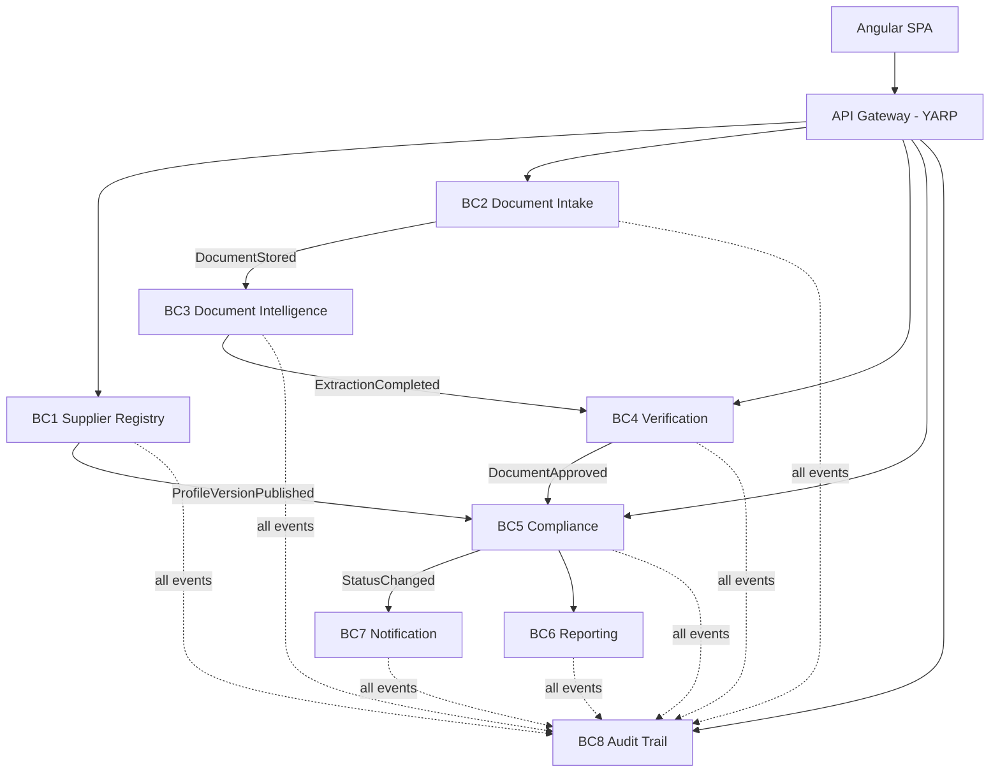

# Certiflow

**Supplier compliance & document verification platform.** Suppliers upload certificates; the
system reads each one with an LLM, extracts the compliance-relevant fields **with a computed
confidence score and a citation back to the exact source text**, routes anything uncertain to a
human reviewer, continuously derives each supplier's compliance status from the evidence it
actually holds, and records every action in a tamper-evident audit trail.

.NET 9 · DDD · microservices · event-driven · Azure

---

## The problem

> *"Suppliers send us certificates — ISO, insurance, licences, safety training. Someone reads each
> PDF by hand, types the expiry date into a spreadsheet, and chases people when they lapse. When an
> audit comes, we can't prove who approved what."*

The failure modes are expensive: an expired certificate found by an auditor, a subcontractor
operating without insurance, or a compliance decision nobody can justify after the fact.

## What makes it not a CRUD app

1. **Grounded document intelligence** — every extracted field is traceable to a verbatim snippet in
   the source document, and confidence is *computed from deterministic checks*, never asked of the
   model.
2. **Human-in-the-loop verification** with segregation of duties — the control enterprises actually
   require, not "the AI decided".
3. **Tamper-evident audit trail** — hash-chained, append-only, with a verify endpoint that names the
   first altered row.

---

## Status

> **Early build.** `dotnet build` → 0 warnings, 0 errors. `dotnet test` → **295 passed, 0 failed.**

This repository currently contains the **domain layer of six bounded contexts, their unit tests, and
the architecture tests** — roughly 3,900 lines across 72 C# files. It does not yet contain
application services, persistence, APIs, messaging, the Angular front end, or any infrastructure.

| Area | State |
|---|---|
| `Certiflow.SharedKernel`, `Certiflow.Contracts` | Written |
| BC1 Supplier Registry — domain + tests | Written |
| BC2 Document Intake — domain + tests | Written |
| BC3 Document Intelligence — domain + tests | Written (**core**) |
| BC4 Verification — domain + tests | Written (**core**) |
| BC5 Compliance — domain + tests | Written (**core**) |
| BC5 Compliance — **application layer** + tests | Written, Must-tier only |
| BC8 Audit Trail — domain + tests | Written |
| Architecture tests (dependency rule) | Written |
| BC6 Reporting, BC7 Notification | Not started — generic subdomains, deliberately last |
| Application layers for BC1–BC4, BC8 | Not started |
| Infrastructure / API layers | Not started |
| Angular front end, Aspire, Bicep, CI/CD | Not started |

Application-layer scope is deliberately limited to **Must**-tier requirements while the depth-wise
scope cut is still open — a Must survives any cut, so none of it is work that might be thrown away.

| Test project | Tests |
|---|---|
| `Certiflow.Intelligence.Domain.Tests` | 81 |
| `Certiflow.SupplierRegistry.Domain.Tests` | 51 |
| `Certiflow.Compliance.Domain.Tests` | 37 |
| `Certiflow.Intake.Domain.Tests` | 30 |
| `Certiflow.Verification.Domain.Tests` | 30 |
| `Certiflow.ArchitectureTests` | 28 |
| `Certiflow.Compliance.Application.Tests` | 22 |
| `Certiflow.Audit.Domain.Tests` | 16 |

## Running it

```bash
dotnet build Certiflow.sln && dotnet test Certiflow.sln
```

Requires the **.NET 9 SDK** — `global.json` pins it, and the build fails fast rather than silently
using whatever SDK happens to be installed. That pin is not ceremony: an unpinned SDK is what
produced 205 spurious analyzer errors the first time this solution was built on a different
machine, because analyzer defaults change between SDK majors.

The build runs with `TreatWarningsAsErrors`, central package management, nullable reference types
and .NET analyzers all enabled, so it is strict by design.

---

## Architecture, and why

Eight bounded contexts, split by **language and rate of change** rather than by entity. The word
"upload" belongs to Intake, "extraction" to Intelligence, "verdict" to Verification, "status" to
Compliance — a term crossing a boundary is translated, never borrowed.



**The core domain is BC3 + BC4 + BC5.** That is where the design effort went; BC6 and BC7 are generic
and will be kept deliberately thin.

### Three decisions worth defending

**Compliance status is derived, never stored.** `SupplierComplianceState.OverallStatus` is the worst
status across mandatory obligations, and each obligation's status is a pure function of its evidence
and a date. A stored status drifts the moment a certificate expires overnight and nobody runs a job;
derivation makes that drift impossible. See [ADR-0001](docs/adr/0001-compliance-status-is-derived.md).

**Confidence is computed, not model-reported.** The model returns a value *and* the verbatim text it
read it from. `GroundingVerifier` then looks for that text in the document — a model that invents an
expiry date must also invent the sentence containing it. Grounding is a **veto**, not a weight: an
unlocatable citation scores 0, not 0.60. See [ADR-0002](docs/adr/0002-computed-confidence.md).

**The audit trail is hash-chained and append-only.** Each entry hashes its contents together with its
predecessor's hash, over a length-prefixed canonical form. Tampering becomes *detectable*, and the
verifier names the first broken row. See [ADR-0003](docs/adr/0003-hash-chained-audit-trail.md).

### Layout

```
src/
  shared/
    Certiflow.SharedKernel/     # base types only — zero NuGet deps, zero business concepts
    Certiflow.Contracts/        # integration event DTOs — references nothing at all
  services/<context>/
    Certiflow.<Context>.Domain/ # aggregates, VOs, invariants. Zero NuGet dependencies.
tests/
  Certiflow.<Context>.Domain.Tests/
  Certiflow.ArchitectureTests/  # the dependency rule, enforced by the build
```

The dependency rule is not a convention here — `tests/Certiflow.ArchitectureTests` fails the build if
a domain assembly references EF Core, MassTransit, ASP.NET, `Certiflow.Contracts`, or another
context's domain. That is the answer to *"how do you stop Clean Architecture rotting?"*

---

## Stack

| Layer | Technology |
|---|---|
| Runtime | .NET 9 · C# 13 · ASP.NET Core Minimal APIs |
| Architecture | Clean Architecture · DDD · CQRS/MediatR · FluentValidation · NetArchTest |
| Data | EF Core 9 · Azure SQL · transactional outbox |
| Messaging | Azure Service Bus (topics) · MassTransit |
| AI | Azure OpenAI `gpt-4o-mini` · structured outputs · PdfPig for grounding |
| Documents | Azure Blob Storage · QuestPDF |
| Front end | Angular 20 · signals · Angular Material · ngx-extended-pdf-viewer |
| Infra | Container Apps · Static Web Apps · Key Vault + managed identity · Bicep · GitHub Actions |
| Testing | xUnit · FluentAssertions · Testcontainers · NetArchTest |

Only the runtime, architecture and testing rows are exercised by the code currently in the repo.

---

## Trade-offs

**One SQL instance, one schema per context — not eight databases.** The Azure SQL free offer gives
one database per subscription, and eight would cost $40–80/month against a $20 ceiling. Each context
keeps its own schema, `DbContext`, migrations and SQL login; cross-schema queries and foreign keys are
forbidden. Everything that matters about the separation is preserved, and only the physical split is
deferred — which is a connection-string change.

**Microservices for an app this size are deliberate, not automatic.** For a real client at this scale
I would start with a modular monolith and split when a boundary actually hurt. The split here exists
to make the boundaries visible and defensible. The contexts are already structured so that collapsing
them would be a hosting change, not a rewrite.

**Confidence weights are a judgement call.** The 0.40/0.20/0.20/0.15/0.05 split comes from the design
document, not from calibration data. What is *not* a judgement call is grounding being a veto rather
than a weight, and unevaluated signals being renormalised away rather than counted as failures.

**Entity matching is pass/fail at 0.85 similarity, not graded.** Graded credit would let a
certificate issued to "Meridian Logistics Group" instead of "Meridian Logistics SARL" score 0.95 and
sail past auto-accept — the exact failure this product exists to catch.

**Two dependencies are pinned below their latest release for licensing reasons.** MediatR is held at
`12.4.1` and FluentAssertions at `6.12.2` — the last Apache-2.0 versions of each, before both moved
to paid commercial licences. Neither project needs anything the newer versions added. Worth knowing
before you inherit a solution that quietly requires a per-seat licence to build.

---

## License

Not yet chosen.
